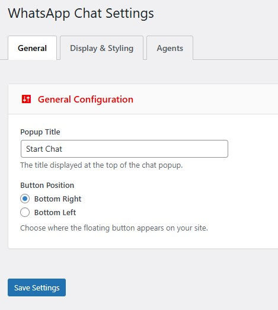
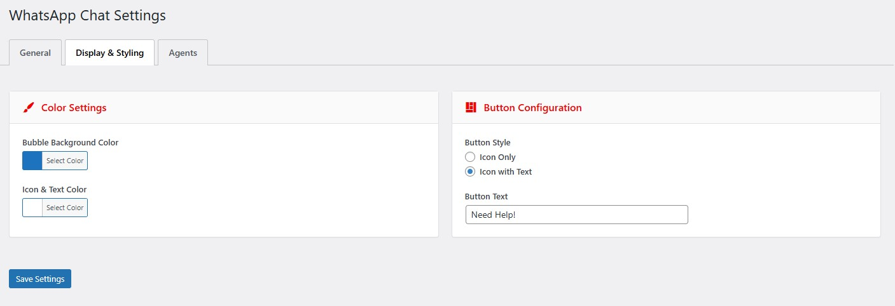
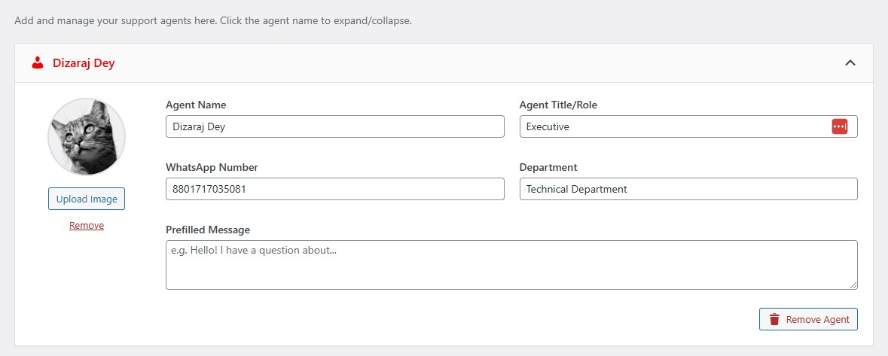
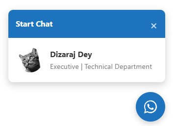
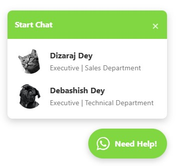
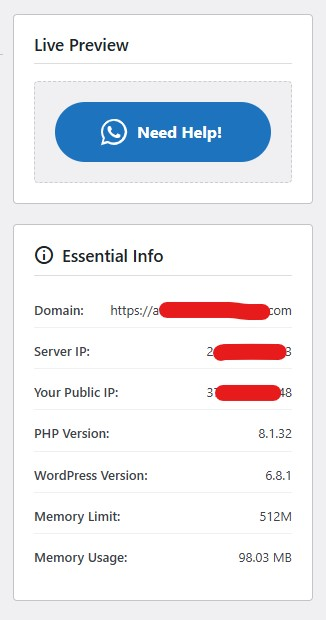

# Floating WhatsApp Chat Pro Widget for WordPress

Add a customizable, multi-agent floating WhatsApp chat widget to your WordPress website. Engage with your visitors directly, provide instant support, and boost your conversions.

This plugin allows you to add a floating WhatsApp chat widget that is highly customizable and easy to manage. Add one or multiple agents for your customers to contact. With a Pro license, you can unlock powerful features like custom agent avatars and department management.

---

### ✨ Features

#### Free Features
* **Floating Chat Widget:** A beautiful, non-intrusive chat button that floats on your website.
* **Single Agent:** Configure one support agent with a name, title, and WhatsApp number.
* **Customizable Widget:**
    * **Popup Title:** Set a custom title for the chat window.
    * **Button Position:** Place the widget on the bottom-right or bottom-left of the screen.
    * **Color Scheme:** Full control over the background and icon colors to match your brand.
    * **Button Style:** Choose between an 'Icon Only' button or an 'Icon with Text' style.
    * **Custom Button Text:** Define your own call-to-action text (e.g., "Need Help?").
* **Prefilled Message:** Set a default message to make it easier for users to start a conversation.
* **Live Preview:** See your customizations in real-time within the admin dashboard.
* **Easy to Use:** A clean, intuitive settings panel makes configuration a breeze.

#### 🚀 PRO Features
* **Multiple Agents:** Add an unlimited number of support agents to handle different queries.
* **Custom Agent Avatars:** Upload a unique profile picture for each agent to build trust and add a personal touch.
* **Department Management:** Assign agents to specific departments (e.g., Sales, Support, Billing) to help customers connect with the right person quickly.
* **7-Day Free Trial:** Request a trial key directly from the plugin to test all Pro features.
* **Priority Support:** Get faster, dedicated email support from the developer.
* **Continuous Updates:** Receive ongoing updates with new features and improvements.

---

### ⚙️ Installation

1.  Download the plugin `.zip` file from the repository.
2.  Navigate to your WordPress Admin Dashboard.
3.  Go to **Plugins > Add New > Upload Plugin**.
4.  Choose the downloaded `.zip` file and click **Install Now**.
5.  After installation, click **Activate Plugin**.
6.  You will find the new **WhatsApp Chat** menu item in your dashboard.

---

### 📖 How to Use

#### Initial Setup
1.  Go to **WhatsApp Chat > Settings**.
2.  On the **General** tab, configure the `Popup Title` and `Button Position`.
3.  On the **Display & Styling** tab, customize the `Bubble Background Color`, `Icon & Text Color`, and `Button Style` to match your brand.
4.  On the **Agents** tab, add your first support agent. You must provide a name and a valid WhatsApp number (including the country code).
5.  Click **Save Settings**. The widget will now be live on your site!

#### Activating Pro Features
1.  Navigate to **WhatsApp Chat > Activate Pro**.
2.  To test the premium features, you can request a **7-day trial key** by entering your email and clicking the "Request Trial Key" button.
3.  If you have purchased a license key, go to [https://whatsapp-pro-chat.web.app/](https://whatsapp-pro-chat.web.app/) to get one.
4.  Enter your trial or full license key into the **License Key** field and click **Save & Activate**.
5.  Once activated, you can go back to the **Agents** tab to add multiple agents, upload custom avatars, and assign departments.

---

### 🖼️ Screenshots

*(Here you can add screenshots of the admin panel and the frontend widget.)*

**1. Admin Settings - General**

**2. Admin Settings - Display & Styling**

**3. Admin Settings - Agent Management (Pro)**

**4. Frontend - Floating Widget (Icon Only)**

**5. Frontend - Chat Popup with Multiple Agents (Pro)**

**6. Admin - Real Time Preview with Essential Info**

---

### 💬 Support

If you have any questions, require support, or have feedback, please feel free to reach out to the developer:

* **Developer:** Dizaraj Dey
* **Email:** [dizaraj@gmail.com](mailto:dizaraj@gmail.com)
* **WhatsApp:** [+8801717035081](https://wa.me/8801717035081)
* **Messenger:** [m.me/dizaraj](https://m.me/dizaraj)

---

### ❤️ Support the Project

This plugin is open-source and free to use. If you find it useful and would like to support its continued development, maintenance, and the creation of more helpful tools, please consider showing your appreciation. Your support is greatly valued!

---

### 📜 License

This plugin is licensed under the **GPL-2.0+**.
For more information, see the [License URI](http://www.gnu.org/licenses/gpl-2.0.txt).